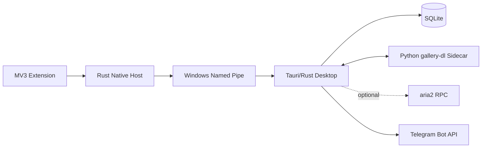

# 总体架构

XArchive 是一个本地优先的 X/Twitter 归档系统。浏览器 Extension 负责发现内容和发起动作，Tauri/Rust Desktop 负责所有业务状态，Python Sidecar 负责适应 X 的提取变化，Telegram 只作为人类友好的展示层。

## 组件边界

- **Extension**：识别 Tweet、提取当前 DOM metadata、注入按钮、批量查询状态；不读 Cookie、不访问文件、不调用 Telegram。当前已实现 classic content script、Tweet DOM adapter、MutationObserver、按钮去重和 Native Messaging Bridge。
- **Native Host**：Native Messaging 与 Named Pipe 的 framing、校验和转发；不保存业务数据。当前已实现 Chromium 长度前缀 framing、消息校验和结构化错误响应；Windows Named Pipe 转发仍待实现。
- **Desktop/Rust**：Archive Manager、Job Queue、SQLite、Metadata Merger、FileStore、Download Router、Sidecar/aria2 Supervisor、Telegram、恢复和 GUI。
- **Python Sidecar**：长驻 JSONL Worker，使用固定版本 gallery-dl 完成 X 提取和默认下载；日志写 stderr，stdout 只输出协议事件。
- **gallery-dl Adapter**：通过参数数组调用 CLI，使用 staging 目录和 info JSON 归一化结果；不让 gallery-dl 内部对象直接进入 Rust 协议。
- **媒体结果契约**：Sidecar 以 `file` 事件报告实际文件，并以 `complete.files` 汇总结果；Rust 负责最终路径、大小和 hash 校验。
- **aria2**：后期可选，只负责已提取直链的文件传输，不能替代 gallery-dl 的 X extractor。
- **aria2 协议层**：`xarchive-download` 已定义 RPC 请求、GID、状态和文件进度模型，并提供跨平台 loopback HTTP JSON-RPC client；真实进程监督、artifact 分发与传输路由仍属于后续工作。
- **Telegram contract**：`xarchive-telegram` 提供 SecretStore abstraction、Bot API request models、metadata formatter、UTF-8 continuation 和 media group 分组；真实 HTTP transport、Windows Credential Manager adapter 和发送恢复流程仍属于后续工作。
- **Reliability/TagEngine**：`xarchive-core` 提供错误类别、retry/backoff policy、Windows-safe 用户目录名和确定性的 TagEngine 规则匹配。
- **IDM**：不进入核心架构，最多作为未来个人环境中的实验性外部提交功能。

## 关键不变量

1. Rust/主 SQLite 是唯一业务事实来源。
2. Sidecar/aria2 只产生执行事件，不能自行决定归档最终成功。
3. 所有下载先进入 `_staging/<job_id>`，由 Rust 校验后提交最终目录。
4. Extension 与 Desktop 只传 metadata、命令和状态，不传媒体二进制或 Cookie。
5. 同一 Tweet ID 的活动归档任务必须幂等。