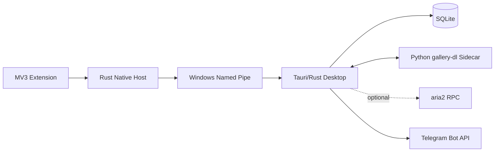

# 总体架构

XArchive 是一个本地优先的 X/Twitter 归档系统。浏览器 Extension 负责发现内容和发起动作，Tauri/Rust Desktop 负责所有业务状态，Python Sidecar 负责适应 X 的提取变化，Telegram 只作为人类友好的展示层。

```mermaid
flowchart LR
    E[MV3 Extension] --> N[Rust Native Host]
    N --> P[Windows Named Pipe]
    P --> R[Tauri/Rust Desktop]
    R --> DB[(SQLite)]
    R <--> S[Python gallery-dl Sidecar]
    R -. optional .-> A[aria2 RPC]
    R --> T[Telegram Bot API]
```

## 组件边界

- **Extension**：识别 Tweet、提取当前 DOM metadata、注入按钮、批量查询状态；不读 Cookie、不访问文件、不调用 Telegram。当前已实现 classic content script、Tweet DOM adapter、MutationObserver、按钮去重和 Native Messaging Bridge。
- **Native Host**：Native Messaging 与 Named Pipe 的 framing、校验和转发；不保存业务数据。当前已实现 Chromium 长度前缀 framing、消息校验和结构化错误响应，以及 Windows Named Pipe server、ACL 与浏览器安装接线；真实 Windows 注册与浏览器验收仍待执行。
- **Desktop/Rust**：Archive Manager、Job Queue、SQLite、Metadata Merger、FileStore、executor、Sidecar/aria2 Supervisor、Telegram、恢复和 GUI；U8 后不再有旧 `DownloadRouter` fallback 或同步 `archive_tweet` 业务入口。
- **事务与工作流边界（共享原型，尚未生产接线）**：独立 `xarchive-workflow` crate 定义 attempt identity、状态/路径合同和协调抽象；Unix `fcntl` adapter 已通过若干真实跨进程竞争及崩溃释放测试，但同进程互斥及完整资源所有权尚未证明，因此不能视为可供生产生命周期使用的锁。`xarchive-storage` 有 SQLite finalization primitive、文件重放 helper 和 attempt staging helper；Desktop 仍未将它们组成正常归档与启动恢复共用的生产工作流。SQLite 事务只原子提交数据库事实，文件移动是独立的可恢复步骤，Telegram 网络发送不属于本地 finalize 事务。目标是同主机多个进程操作同一受支持本地数据工作区；跨主机与网络文件系统分布式执行不在当前范围。协调语义、attempt/cancel/PREPARED 仲裁、文件 fencing 和服务级崩溃矩阵仍为 `CROSS_PLATFORM_CHANGE_REQUIRED`；生产 v2 保持 fail-closed。实现顺序和验收门槛见下载输出 Plan 的 C1 execution sequence。
- **Python Sidecar**：长驻 JSONL Worker，使用固定版本 gallery-dl 完成 extraction 与（可选的）直接下载；日志写 stderr，stdout 只输出 protocol v2 事件。
- **gallery-dl Adapter**：通过参数数组调用 CLI，使用 metadata/staging 目录归一化 typed extraction result；不让 gallery-dl 内部对象直接进入 Rust 协议。`extract` 命令只提取元数据；`download` 命令在可选下载模式下把媒体字节直接写入命令指定的 staging 目录。
- **媒体结果契约**：Sidecar 报告 typed metadata/media plan；`use_aria2` 关闭时 gallery-dl 直接把媒体写入 staging，Rust 负责最终路径、大小、reparse 和 hash 校验；`use_aria2` 开启时由 aria2 将媒体写入 staging，校验规则相同。
- **aria2**：可选媒体 transfer backend，只负责已提取直链的传输，不能替代 gallery-dl 的 X extractor。默认关闭（`use_aria2 = false`），关闭时 aria2 不启动。
- **aria2 协议层**：`xarchive-download` 已定义 RPC 请求、GID、状态和文件进度模型，并提供跨平台 loopback HTTP JSON-RPC client 与基础 `Aria2Supervisor` 进程监督层；真实 aria2c.exe 生命周期、artifact 分发与传输路由仍属于后续工作。
- **Downloader 参数信任边界（已确认目标，尚未实现）**：Rust 计划作为用户自定义 downloader 参数策略的唯一验证权威；Sidecar 负责协议结构与 argv 边界，不重复维护用户选项 allowlist。此合同及接线尚未完成，详见下载输出 Plan。
- **Sidecar v2 task arguments（协议模型已实现，E 未完成）**：`download` 可选携带 `user_args: string[]`，由 Rust 命令模型和 Python worker 做结构/长度验证；Python 仅在该次 gallery-dl download 的 argv 中逐项传递。Rust option-policy、v3 execution snapshot 和 Desktop 传参接线尚未实现，不能视为生产支持。
- **Telegram contract/transport**：`xarchive-telegram` 提供 SecretStore abstraction、Bot API request models、metadata formatter、UTF-8 continuation、media group 分组和基于 `reqwest` + Rustls 的 HTTPS transport；发送持久化与恢复、sender worker、命令和 UI 已在 Desktop 接线。Windows Credential Manager adapter 与真实账号发送仍属 Windows 工作。
- **Reliability/TagEngine**：`xarchive-core` 提供错误类别、retry/backoff policy、Windows-safe 用户目录名和确定性的 TagEngine 规则匹配。
- **IDM**：不进入核心架构，最多作为未来个人环境中的实验性外部提交功能。

## 关键不变量

1. Rust/主 SQLite 是唯一业务事实来源。
2. Sidecar/aria2 只产生执行事件，不能自行决定归档最终成功。
3. 当前下载使用 Job staging；C1 目标改为 attempt 隔离的 staging，由 Rust 校验并经可恢复工作流提交最终目录。不同进程可并发处理不同 Job；同 Job 和最终目的地竞争须由经过同进程与跨进程验证的协调及 no-replace 文件操作保护。现有 helper 与跨进程测试不构成生产保证；该目标尚未实现。
4. Extension 与 Desktop 只传 metadata、命令和状态，不传媒体二进制或 Cookie。
5. 同一 Tweet ID 的活动归档任务必须幂等。