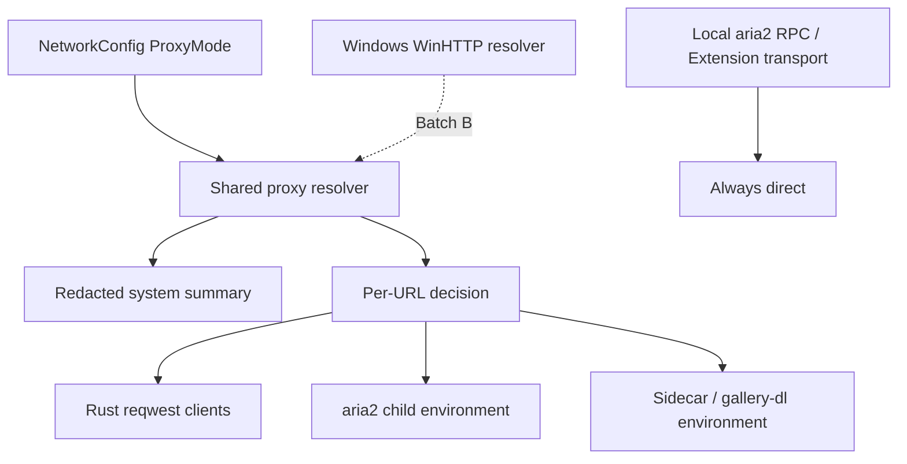

# Desktop System Proxy Plan

Owner: Linux Cross-platform Owner (shared network contract, shared configuration, shared clients, cross-platform checks), Windows Platform Owner (Windows system proxy resolution and Windows GUI acceptance).
Status: `BATCH_A_DELIVERED` — Batch A (the Linux shared implementation) landed on `dev` at `edbae53`; the handoff record follows it in `919df71`. Batch B (the Windows native resolver) is still outstanding, so this is an implementation record, not validation evidence: no Windows item in `docs/validation/windows-queue.md` has been executed.

## 1. Objective

Add a user-visible proxy mode to the Settings page so a Windows user behind a corporate proxy can keep the Desktop application usable, and so the current behavior stops depending on ambient environment variables that the application never documents.

The outcome is a three-state mode, one shared network boundary, and an honest statement of what "system proxy" means on each platform.

## 2. What the current code actually does

The starting point is a single optional string, not a proxy strategy.

- `NetworkConfig.proxy: Option<String>` (`desktop/src-tauri/src/config.rs`) is the only proxy input. It is validated for whitespace, control characters, scheme, and host.
- `NetworkConfig::sidecar_env` passes it to the Sidecar as `XARCHIVE_PROXY`; `crates/xarchive-download/src/supervisor.rs` forwards it to aria2 as `all_proxy`, `http_proxy`, and `https_proxy` in the child environment, never on the command line.
- `sidecar/src/xarchive_downloader/extraction.py` copies the configured proxy into `HTTP_PROXY`/`HTTPS_PROXY` and their lowercase forms for gallery-dl child processes.
- `crates/xarchive-telegram/src/lib.rs` builds a reqwest client and calls `no_proxy()` when asked, but the `proxy` argument is explicitly discarded (`let _ = proxy;`). A configured proxy therefore does not reach Telegram.
- `desktop/src-tauri/src/aria2.rs` builds a separate reqwest client for the aria2 release download and applies no proxy policy.
- Every reqwest manifest sets `default-features = false`, so the `system-proxy` feature is off.

Because the proxy is applied through child-process environment variables, a user who sets `HTTP_PROXY` in the launching shell can also change Desktop behavior without touching the configuration file, and the Settings page shows nothing about it.

## 3. Confirmed constraints from the pinned dependencies

These were verified against the vendored sources, not from memory.

- reqwest 0.13.4 lists `system-proxy` in its `default` feature set, so `default-features = false` disables it.
- With the feature enabled, `ClientBuilder::build` appends `ProxyMatcher::system()` when `auto_sys_proxy` is true, and both `.proxy(..)` and `.no_proxy()` set `auto_sys_proxy = false`.
- `ProxyMatcher::system()` delegates to `hyper_util::client::proxy::Matcher::from_system()`.
- hyper-util 0.1.20 `Builder::from_system` starts from `from_env()` and then, on Windows, calls `win::with_system`.
- On Windows that `win::with_system` reads only `HKCU\Software\Microsoft\Windows\CurrentVersion\Internet Settings` values `ProxyEnable`, `ProxyServer`, and `ProxyOverride`. It returns early when `ProxyEnable` is 0, and it never reads `AutoConfigURL` or `AutoDetect`.
- The same function joins `ProxyOverride` on `;` and then applies a blanket `.replace("*.", "")`, which is not the documented Windows bypass grammar.

Consequences that the design must respect:

1. Enabling reqwest `system-proxy` is **not** PAC or WPAD support. A user on a PAC or WPAD deployment would still be routed by the registry manual proxy or by environment variables, which is wrong or silent.
2. The `*.` rewrite means bypass entries that depend on wildcard semantics cannot be trusted through this path.
3. `from_env()` means "use the system proxy" also means "inherit whatever proxy variables the launching environment happens to define". That is acceptable for `System` and must be suppressed for `Direct`.

Microsoft reference behavior for the full semantics, which Batch B must reach:

- `WinHttpGetIEProxyConfigForCurrentUser` reports the current user's manual proxy, bypass list, auto-config URL, and auto-detect flag, and the caller must free the returned strings.
- `WinHttpGetProxyForUrl` must be called per target URL because a PAC may answer differently for different URLs, so a single resolved proxy cannot be cached as a global constant.
- Auto-discovery is blocking and can take seconds, so resolution must not run on a UI thread or per request.

## 4. Scope

### 4.1 Shared contract (Batch A, Linux)

1. Replace the single string with a three-state `ProxyMode`: `System`, `Direct`, `Manual`. `Manual` keeps the existing value in `network.proxy` so no credential is duplicated and the existing validators still apply.
2. Preserve migration: an existing non-empty `network.proxy` loads as `Manual`. An existing empty configuration loads as `System` only after the default is recorded explicitly, because today the behavior is "inherit the environment", which is closest to `System`.
3. Add one shared resolution boundary that reports a redacted summary and a per-URL decision, so callers never read a proxy value directly.
4. Apply the mode at every network boundary, including the two that are currently inconsistent: the discarded Telegram `proxy` argument and the unconfigured aria2 download client.
5. For `Direct`, clear inherited proxy environment variables for child processes as well as calling `no_proxy()` in Rust, otherwise "direct" is not actually direct.
6. Keep local aria2 RPC and the local Extension transport direct in every mode.
7. Expose the mode and a redacted summary in the Settings page, with save, refresh, and a clear statement of what the current mode does and does not cover.

### 4.2 Windows native resolution (Batch B, Windows)

1. A Windows resolver that reads the current user's configuration through the documented WinHTTP surface and resolves per target URL, so PAC and WPAD are honored.
2. A redacted summary for the Settings page that distinguishes manual, PAC, WPAD, and none, and never claims a per-URL result it did not compute.
3. A resolution failure must surface as an explicit error. It must not silently fall back to a direct connection, because that would bypass the user's or their employer's network policy.
4. GUI acceptance of the Settings page and the real download path.

### 4.3 Explicitly out of scope

- Implementing a PAC JavaScript engine. Windows resolves PAC; the application does not.
- A new username/password credential store. Manual proxy credentials continue to travel in `network.proxy` with the existing redaction rules.
- Changing the browser Extension's own proxy behavior or any Chrome/Edge global proxy setting.
- Changing the local aria2 RPC, the local named pipe, or the SQLite/log locations.
- Relaxing `unsafe_code = "forbid"`, and adding an unvetted `windows` crate dependency as a shortcut. If Batch B needs FFI, that is a separate reviewed decision, not a side effect of this feature.

## 5. Design

- The resolver returns a decision, not a raw string, and the decision distinguishes `Direct`, `Proxy`, `ResolutionFailed`, and `Unsupported`. This keeps "the system has a PAC configured" from being displayed as "this request is proxied".
- Each client is built once and reused, matching the existing `reqwest::Client` reuse, so a mode change replaces the client instead of rebuilding it per request.
- A mode change applies to new work. An in-flight job keeps the network snapshot it started with, so a download does not change route halfway.
- The application never mutates its own global process environment to implement a mode; it passes an explicit child environment, which keeps `Direct` honest and keeps the change testable.

### 5.1 What Batch A actually delivered

The shared layer owns the contract so the configuration, the boundaries, and the
settings surface cannot drift:

- `crates/xarchive-core/src/proxy.rs` holds `ProxyMode`, `ProxyDecision`,
  `ChildEnvironment`, and a case-insensitive proxy-variable test. The Desktop
  configuration re-exports `ProxyMode` instead of redefining it.

Two implementation points differ from a first reading of the design above, both
forced by real behavior:

1. **Migration needs key presence, not a default.** `#[serde(default)]` cannot
   tell a document that never mentioned the mode from one that deliberately
   chose `system`. Without that distinction a leftover stored proxy would make an
   explicit `system` choice look legacy and be rewritten to `manual` on every
   load. `AppConfig::load` therefore inspects the raw document for the key and
   records `proxy_mode_declared`, which gates the migration. The migration also
   runs before validation, because a legacy document is only valid once it is a
   `Manual` with a value.

2. **Environment removal must be case-insensitive.** Windows treats environment
   variable names case-insensitively, so removing only the exact spellings would
   leave `Http_Proxy` in the child and silently re-enable the proxy. The Sidecar
   supervisor and `spawn_env` both sweep inherited names case-insensitively, and
   only when a removal was actually requested, so `System` keeps what it
   inherited.

`platform_resolver()` is the single swap point for Batch B. It returns the
environment resolver on every platform today, which is what the pinned
dependencies can actually deliver. Reporting a Windows registry or PAC result
before that resolver exists would be a claim the code cannot keep, so
`system_proxy_supported` is `false` and the Settings page says so.

## 6. Ownership routing

- Linux Cross-platform Owner: the `ProxyMode` contract, configuration and migration, the shared resolver boundary, client construction, child-process environment rules, the Settings UI, shared tests, and Linux checks.
- Windows Platform Owner: the WinHTTP-backed resolver, Windows bypass and PAC/WPAD behavior, and the Settings GUI acceptance.
- If Windows finds that correct behavior requires a change to the shared contract, the configuration schema, or the child-process protocol, mark `CROSS_PLATFORM_CHANGE_REQUIRED` and return to Linux. A small shared adjustment that preserves the abstraction is `CROSS_PLATFORM_REVIEW_REQUIRED`.
- Batch B must not be reported as delivered on the strength of Batch A tests. Linux has no Windows proxy environment to test against.

## 7. Validation plan

Escalation starts at Targeted and only escalates when the impact area requires it.

| Level | Scope |
|---|---|
| Targeted | `ProxyMode` parsing, migration, validation, redaction, child-environment rules, and the resolver decision mapping, driven by a fake resolver. |
| Module | `xarchive-desktop` plus `xarchive-download` and `xarchive-telegram`, and the frontend wiring tests. |
| Windows | The queue in `docs/validation/windows-queue.md`, against an exact revision. |

Acceptance scenarios that cannot be closed on Linux:

- A Windows user with a manual proxy: `System` uses it, the bypass list applies, and the redacted summary shows it.
- A Windows user with a PAC: different URLs resolve to different routes, and `Direct` for an excluded host is honored.
- A Windows user with WPAD: resolution succeeds, and a failing or slow discovery surfaces an error instead of a silent direct connection.
- `Direct` stays direct even when `HTTP_PROXY` and `HTTPS_PROXY` are set in the launching environment.
- `Manual` reaches every boundary, including Telegram and the aria2 download, which is currently not true.
- Proxy credentials never reach the log file, the SQLite diagnostics, the process command line, or a frontend event.
- Local aria2 RPC and the Extension transport stay direct in all three modes.

Redirection and permission testing must use an isolated user or a virtual machine. When GUI automation is unavailable, record `BLOCKED` with `COMPUTER_USE_UNAVAILABLE` and keep the item open; an unexecuted GUI check is never recorded as PASS.

## 8. Handoff

- Batch A is committed and pushed through Git before Windows validation begins, recording branch, source commit, handoff commit, uncommitted-state status, and owner.
- Windows validates the exact Batch A revision. It must not validate a local working tree.
- Do not overwrite the Windows Owner's canonical working tree; direct sync stays diagnostic.
- Review the final `git diff` before finishing.

## 9. Completion criteria

1. The mode is a three-state value in configuration and survives a restart.
2. An existing `network.proxy` configuration loads as `Manual` without losing the value or its redaction.
3. Every network boundary applies the mode, including Telegram and the aria2 download.
4. `Direct` suppresses inherited proxy environment variables for child processes.
5. Local aria2 RPC and the Extension transport are never proxied.
6. The Settings page shows the mode, a redacted summary, and the coverage boundary.
7. No proxy credential reaches a log, the database, a command line, or the frontend.
8. The UI never claims a per-URL proxy result that the resolver did not compute.
9. Targeted and Module checks pass on Linux, and every Windows item is recorded with an explicit revision and result state.
