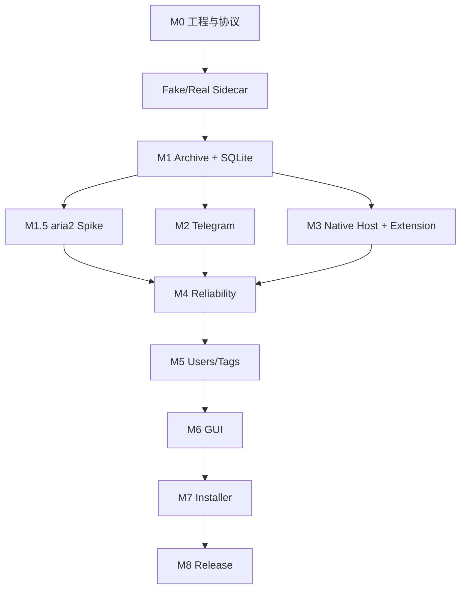

# 开发路线图

## M0：Rust ↔ Python 单 Tweet 下载

建立 Sidecar 握手、JSONL 命令和事件、Fake Worker、gallery-dl Adapter、staging 下载和崩溃检测。

## M1：SQLite 与本地归档

加入 migrations、Archive Manager、Job 状态机、Metadata Merger、FileStore、JSON/TXT、Tweet ID 幂等、恢复和 SHA-256。

当前进度：已完成 Job 状态机、SQLite migration、SQLite 基础 Repository、staging FileStore、SHA-256、ArchiveService、gallery-dl CLI Adapter、JSONL Worker 集成、媒体文件扫描、`file`/`complete.files` 事件契约、Rust Sidecar 结果转换、ArchiveService 端到端闭环、Windows 基础验证、Tauri Desktop 脚手架和核心测试；`SupervisorEvent::Download` 的 `large_enum_variant` 与 Telegram formatter 的 `single_char_add_str` 等历史 lint 问题已修复，`icon.ico` 开发资源已补齐。最新 Windows workspace fmt/check/test、严格 clippy、Debug/Release 编译和 Tauri Release 构建通过；aria2 路径扫描的 clippy 问题已在 Linux 用 let-chain 修复并完成 Windows re-validation。真实 X 认证下载、Tauri Windows GUI/打包验证仍待完成。
已完成 Rust SidecarSupervisor 与真实 Python Worker 的 hello/download/shutdown 进程集成测试，并验证真实 sidecar 在 Unicode/空格路径中的 JSONL 失败链路。

## M1.5：aria2 技术验证

实现 `DownloadTransport` 抽象和 Rust aria2 Supervisor。验证 RPC、进度、取消、断点恢复、URL 过期、认证 Header、崩溃恢复和许可证分发要求。通过门槛后才加入 Automatic Router。

当前进度：已完成 `xarchive-download` 协议模型、RPC 请求构造、状态/字节数解析、安全校验、跨平台 loopback HTTP JSON-RPC client、fake-server 测试、基础 `Aria2Supervisor` 进程监督层，以及 Tauri Desktop 的 aria2 检测/版本选择/官方 Windows x64 artifact 下载管理 UI。最新 Windows 验证发现 `candidate_aria2_paths` 的 `clippy::collapsible_if`，已在 Linux 端用 let-chain 修复；Linux fmt/check/test 回归与 Windows clippy re-validation 均已通过。真实 aria2c.exe Windows 下载/解压/运行时、断点恢复、崩溃恢复、artifact 分发、Windows 打包和默认 Download Router 仍需 Windows/发布环境验证或后续实现。默认下载仍使用 gallery-dl。

## M2：Telegram

实现 SecretStore、Official API Transport、Formatter、TagEngine、media reply/group、长文本 continuation、幂等补传。

当前进度：已完成跨平台 `xarchive-telegram` contract crate，包括 SecretStore abstraction、内存测试实现、Bot API request models、metadata formatter、UTF-8 长文本分段、media group 分组、边界测试，以及基于 `reqwest 0.13.4` blocking + Rustls 的 Telegram HTTPS transport；transport 已通过本地 fake-server 覆盖 `sendMessage`、`sendPhoto`、`sendVideo`、`sendMediaGroup`、HTTP/API 错误和 token 脱敏。发送状态持久化与幂等补传已完成：`SendState`/`SendStateStore` 契约与 `send_idempotently` 编排位于 `xarchive-telegram`，SQLite 持久化由 `xarchive-storage` 通过 migration `0002_telegram_send_state.sql`（`telegram_send_attempts` 表，`UNIQUE(chat_id, idempotency_key)`）实现并通过 Linux 测试（全量 69 个 crate 单元测试）；Windows 已对 `add84c0` 及其后续全部 revision（最新 `5fbc675`，业务代码与 `add84c0` 一致）全量复验通过（含上述单元层测试；69 项 crate 测试计数已在两侧按 crate 清点确认），单元层已 Windows 验证。基于文件的 SQLite 路径行为、应用重启现场恢复、迁移升级专项验证以及 Windows Credential Manager 和真实账号验证仍待完成，生产 endpoint 强制使用 HTTPS。

## M3：MV3 Extension 与 Native Messaging

实现 XDomAdapter、MutationObserver、按钮、Service Worker、Native Host、Named Pipe、批量状态同步和重连。

当前进度：已完成跨平台 BrowserRequest/BrowserResponse 模型和 schema、Chromium Native Messaging framing、消息校验、Extension Tweet DOM adapter、按钮去重、MutationObserver、Service Worker Bridge、request_id 路由和断线处理；Named Pipe、Host manifest/Registry、Edge/Chrome 实机验证仍待完成。

## M4：可靠性

重试退避、错误分类、Cancel、Sidecar/aria2 恢复、文件完整性扫描、URL 刷新和事件历史。

当前进度：已完成跨平台错误类别、可重试判定、重试预算和指数退避策略；Sidecar/aria2 进程恢复、URL 刷新、事件历史和完整调度接入仍待完成。

## M5：用户与标签

稳定用户目录、名称历史、profile 文件、Quote/Reply 建模和用户自定义 TagEngine 规则。

当前进度：已完成 Windows-safe 用户目录名生成、基于用户名/文本/Tweet 类型/媒体类型的确定性 TagEngine 规则匹配，以及 SQLite users/user_names/tags/tweet_tags Repository API；profile 文件和 Quote/Reply 完整建模仍待完成。

## M6：Tauri GUI

Dashboard、Archive、Users、Settings 和操作菜单。

当前已完成最小 Tauri/React 工程、启动时 SQLite 初始化、运行状态/Job/归档目录/Sidecar commands、Sidecar `hello → ready` 握手、最近 Job 查询、跨平台打开归档目录和基于本地 shadcn/ui 组件的 Dashboard；开发图标资源已补齐，Windows Debug/Release 编译、`npm run dev:tauri` 启动、`npm run build:tauri` Release 构建、Linux Tauri Release 构建和根 workspace/Desktop workspace 的 Tauri CLI 入口已完成。停止开发进程时出现 Chromium `Error = 1411` 注销警告；真实 Sidecar externalBin、Windows GUI/打包仍待实现或验证，UI 自动化 helper 初始化失败。

## M7：安装与生命周期

Sidecar 打包、Tauri externalBin、Native Host manifest/Registry、Single Instance、Tray、Autostart、Windows 安装器。

Windows 专项任务、前置条件和验收标准集中维护在 [`windows-validation.md`](windows-validation.md)。

## M8：发布

签名更新、日志脱敏、备份恢复、诊断包、第三方许可证、版本回滚和发布 CI。

## 依赖顺序

