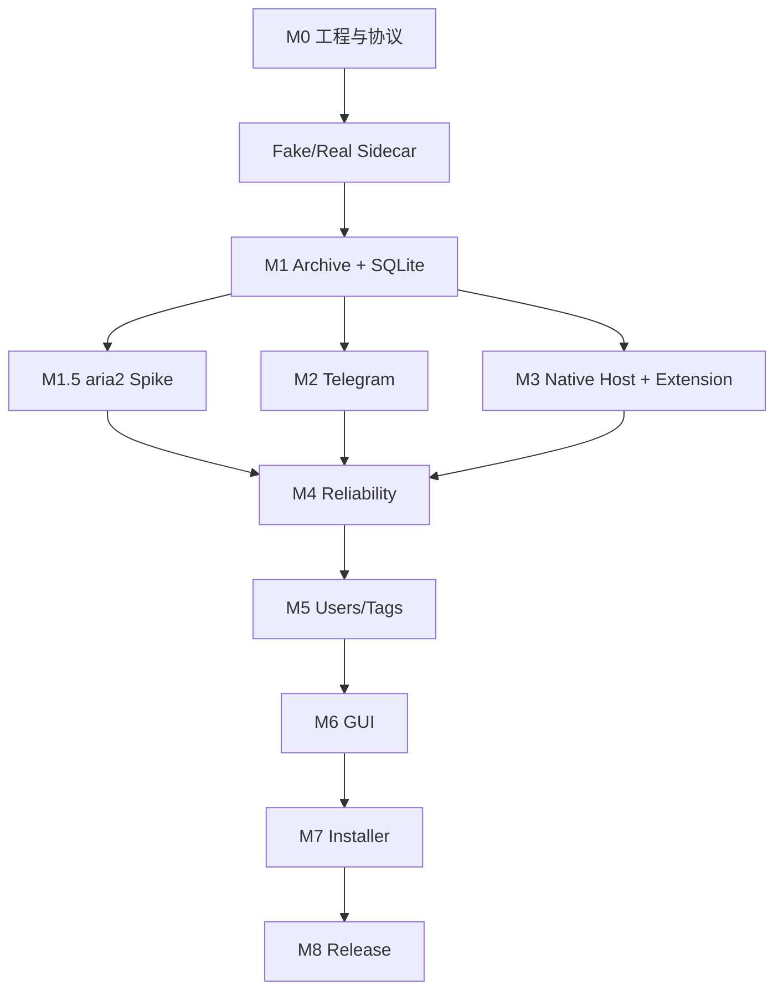

# 开发路线图

## M0：Rust ↔ Python 单 Tweet 下载

建立 Sidecar 握手、JSONL 命令和事件、Fake Worker、gallery-dl Adapter、staging 下载和崩溃检测。

## M1：SQLite 与本地归档

加入 migrations、Archive Manager、Job 状态机、Metadata Merger、FileStore、JSON/TXT、Tweet ID 幂等、恢复和 SHA-256。

当前进度：已完成 Job 状态机、SQLite migration、SQLite 基础 Repository、staging FileStore、SHA-256、ArchiveService、gallery-dl CLI Adapter、JSONL Worker 集成、媒体文件扫描、`file`/`complete.files` 事件契约、Rust Sidecar 结果转换、ArchiveService 端到端闭环、Windows 基础验证、Tauri Desktop 脚手架和核心测试；`SupervisorEvent::Download` 的 `large_enum_variant` 与 Telegram formatter 的 `single_char_add_str` 等历史 lint 问题已修复，`icon.ico` 开发资源已补齐。最新 Windows workspace fmt/check/test、Debug/Release 编译和 Tauri Release 构建通过；此前暴露的 `run_sidecar_download` `too_many_arguments` 已在 Linux 用请求上下文结构修复，并完成 Linux fmt/check/test 回归，Windows 严格 clippy 复验仍待执行。真实 X 认证下载、Tauri Windows GUI/打包验证仍待完成。
已完成 Rust SidecarSupervisor 与真实 Python Worker 的 hello/download/shutdown 进程集成测试，并验证真实 sidecar 在 Unicode/空格路径中的 JSONL 失败链路。

## M1.5：aria2 技术验证

实现 `DownloadTransport` 抽象和 Rust aria2 Supervisor。验证 RPC、进度、取消、断点恢复、URL 过期、认证 Header、崩溃恢复和许可证分发要求。通过门槛后才加入 Automatic Router。

当前进度：已完成 `xarchive-download` 协议模型、RPC 请求构造、状态/字节数解析、安全校验、跨平台 loopback HTTP JSON-RPC client、fake-server 测试、基础 `Aria2Supervisor` 进程监督层、Tauri Desktop 的 aria2 检测/版本选择/官方 Windows x64 artifact 下载管理 UI，以及纯 Rust `DownloadRouter` 业务编排层。Router 默认使用 gallery-dl，仅在收到可回退的 `EXTRACT_OR_DOWNLOAD_FAILED` 且配置允许、调用方提供新鲜 aria2 请求时尝试 aria2；认证、限流和资源不存在错误不会错误回退。最新 Windows 验证发现的 `candidate_aria2_paths` `clippy::collapsible_if` 已在 Linux 端用 let-chain 修复；Linux fmt/check/test 回归与 Windows clippy re-validation 均已通过。已有 Windows 实测证据覆盖官方 aria2c.exe artifact、版本/hash、RPC、Unicode/空格路径、Range 续传、进程中断恢复和 `.aria2` 清理；后续不再重复这些基础链路，只保留 Router 与 Sidecar/Job 的实际接入、403 回退时重新提取 URL、externalBin/打包分发和默认 Download Router 端到端专项验证。默认下载仍使用 gallery-dl。

## M2：Telegram

实现 SecretStore、Official API Transport、Formatter、TagEngine、media reply/group、长文本 continuation、幂等补传。

当前进度：已完成跨平台 `xarchive-telegram` contract crate，包括 SecretStore abstraction、内存测试实现、Bot API request models、metadata formatter、UTF-8 长文本分段、media group 分组、边界测试，以及基于 `reqwest 0.13.4` blocking + Rustls 的 Telegram HTTPS transport；transport 已通过本地 fake-server 覆盖 `sendMessage`、`sendPhoto`、`sendVideo`、`sendMediaGroup`、HTTP/API 错误和 token 脱敏。发送状态持久化与幂等补传已完成：`SendState`/`SendStateStore` 契约与 `send_idempotently` 编排位于 `xarchive-telegram`，SQLite 持久化由 `xarchive-storage` 通过 migration `0002_telegram_send_state.sql`（`telegram_send_attempts` 表，`UNIQUE(chat_id, idempotency_key)`）实现并通过 Linux 测试（全量 69 个 crate 单元测试）；Windows 已对 `add84c0` 及其后续全部 revision（业务代码均与 `add84c0` 一致，最新 `5d9dbd9` 为轻量复核）验证通过（含上述单元层测试；69 项 crate 测试计数已在两侧按 crate 清点确认），单元层已 Windows 验证。基于文件的 SQLite 路径行为、应用重启现场恢复、迁移升级专项验证以及 Windows Credential Manager 和真实账号验证仍待完成，生产 endpoint 强制使用 HTTPS。

## M3：MV3 Extension 与 Native Messaging

实现 XDomAdapter、MutationObserver、按钮、Service Worker、Native Host、Named Pipe、批量状态同步和重连。

当前进度：已完成跨平台 BrowserRequest/BrowserResponse 模型和 schema、Chromium Native Messaging framing、消息校验、Native Host 可插拔请求/响应转发核心、Extension Tweet DOM adapter、按钮去重、MutationObserver、Service Worker Bridge、request_id 路由和断线处理。Native Host 在配置 `XARCHIVE_PIPE_ENDPOINT` 后可打开 Desktop transport endpoint；Windows 预期 endpoint 为 `\\.\\pipe\\xarchive-v1`。Named Pipe server/ACL、Host manifest/Registry、Edge/Chrome 实机验证仍待完成，并保持 `WINDOWS_VERIFICATION_PENDING`。

## M4：可靠性

重试退避、错误分类、Cancel、Sidecar/aria2 恢复、文件完整性扫描、URL 刷新和事件历史。

当前进度：已完成跨平台错误类别、可重试判定、重试预算、指数退避策略和下载后端选择 Router；已完成 Desktop 归档路径的 Router 结果处理、Job 失败状态映射和下载生命周期事件持久化（`JobEvent`、`record_event`/`list_events_for_job`、`DownloadStarted`/`DownloadFailed`/`DownloadCompleted`，workspace 测试通过）。Sidecar/aria2 进程恢复、403 后 URL 刷新、新鲜 aria2 请求构造和完整 transfer 调度仍待完成。

## M5：用户与标签

稳定用户目录、名称历史、profile 文件、Quote/Reply 建模和用户自定义 TagEngine 规则。

当前进度：已完成 Windows-safe 用户目录名生成、基于用户名/文本/Tweet 类型/媒体类型的确定性 TagEngine 规则匹配，以及 SQLite users/user_names/tags/tweet_tags Repository API；profile 文件和 Quote/Reply 完整建模仍待完成。

## M6：Tauri GUI

Dashboard、Archive、Users、Settings 和操作菜单。

### 当前已完成

最小 Tauri/React 工程、启动时 SQLite 初始化、运行状态/Job/归档目录/Sidecar commands、Sidecar `hello → ready` 握手、最近 Job 查询、跨平台打开归档目录和基于本地 shadcn/ui 组件的 Dashboard；开发图标资源已补齐，Windows Debug/Release 编译、`npm run dev:tauri` 启动、`npm run build:tauri` Release 构建、Linux Tauri Release 构建和根 workspace/Desktop workspace 的 Tauri CLI 入口已完成。停止开发进程时出现 Chromium `Error = 1411` 注销警告；真实 Sidecar externalBin、Windows GUI/打包仍待实现或验证，UI 自动化 helper 初始化失败。

### 当前 GUI 设计评估（2026-09-10 白色 Vercel 风格重设计）

当前 `desktop/src/main.jsx` 和 `desktop/src/style.css` 已完成一次白色主色调、Vercel 风格的 Dashboard 重设计：以白底、细灰边框、近黑主按钮、克制阴影和清晰状态 Badge 取代原深色装饰性布局。该结论仅代表 Linux 源码与构建层完成，不代表 Windows WebView2 真实视觉验收完成。

**较好的基础：**

- 白色主背景、近黑文本和细灰边界形成 Vercel 风格的本地控制台基底；
- 绿色/琥珀/红色仅用于状态语义，不承担大面积品牌装饰；
- 侧栏、概览卡、任务列表、运行环境和归档位置形成明确的信息分区；
- 图标为本地 SVG 且未用 emoji；
- 按钮有 disabled/busy/hover；
- aria2 版本选择器有原生 `<label>` + `<select>`；
- HTML 设置了 `lang="zh-CN"`；
- `<aside>` / `<nav>` / `<main>` / `<header>` / `<footer>` 初步具备；
- Tauri 窗口保持 `720×540` 最小尺寸，并增加白色布局下的 `1000px` / `680px` 收缩方案。

**已完成的 Linux/跨平台修复：**

- 系统就绪 Badge 已改为同时要求 Sidecar 与 SQLite ready；
- 初始加载阶段增加统一 `initialLoad` 状态，避免将空列表或 `loading` 显示为错误；
- 全局错误框增加 `role="alert"` 和 `aria-live="assertive"`；
- invoke 错误已按 status/jobs/aria2/folder/sidecar 分离，并在对应 Widget 内提供“重试”入口；
- 紧凑侧栏 `NavItem` 增加 `aria-label`；
- 未实现的“归档库”“文件位置”不再作为禁用主导航展示；
- aria2 面板仅在 Windows 平台展示；
- “总任务”更名为“最近任务”，与 `limit: 20` 的查询范围一致；
- 任务列表使用 `<ul>/<li>`，更新时间使用 `<time dateTime="">`；
- 增加共享 `:focus-visible` 样式和 `prefers-reduced-motion` 保护。
- 白色 Vercel 风格视觉 token、细边框卡片、近黑主按钮和浅色语义状态；
- 顶部工作区标题、状态 Badge 和刷新主操作重新编排；
- 最近任务改为更紧凑的结构化行，时间使用 `Intl.DateTimeFormat("zh-CN", ...)` 格式化；
- 初始任务加载改为轻量 Skeleton，保留真实空状态与局部错误状态的区分；
- 正文和辅助文字字号提高到更适合 Desktop/DPI 的范围，路径和 Job 元数据继续使用等宽字体。

**仍不能仅凭 Linux 代码验证关闭的项目：**

1. **Windows 真实渲染尚未验收。**WebView2/DPI、Tab 顺序、Focus-visible 实际表现、屏幕阅读器播报、命中目标和最终对比度仍需 Windows 实机或 CI。
2. **文件 SQLite 应用级恢复尚未执行。**Desktop 现场重启、遗留 staging、迁移升级和恢复路径仍需专项验证。

**Typography 与 WCAG 静态估算：**

- 新设计将正文提高到 13–14px、辅助文本提高到 12px，减少原先过小字号带来的可读性风险；
- 采用 `#171717`、`#525252`、`#737373` 等分层文本 token，避免在白底上使用低对比度绿色灰；
- 真实 WebView2/DPI 渲染、系统字体回退和最终对比度仍不能仅从源码确定。

**当前 GUI 后续边界：**

1. Linux 侧 GUI 状态真实性、加载/错误恢复、语义结构、Focus-visible、reduced-motion、aria2 平台展示和白色 Vercel 风格视觉重设计已完成；在 Windows 原生 GUI target 可用前，不再继续无依据的 GUI 源码重构；
2. 文件 SQLite 的 Desktop 应用重启、遗留 staging、路径/文件锁和 `0001 → 0002` 迁移仍需设计受控场景，并在 Windows 实机执行；现有 storage 层 reopen/migration 单元测试不能替代应用级验收；
3. 只有在 Windows WebView2 / DPI / Narrator / NVDA 环境验证完成后，才能对桌面无障碍、键盘流程、命中目标和真实对比度做最终 PASS/Fail 结论；之后再逐步扩展 Archive/Users/Settings。

**来自 Screen Reader / Moment / UI Verification 技能的具体建议：**

- 任务列表已使用 `<ul>/<li>`，更新时间已使用 `<time dateTime="">`；后续仍建议使用 `Intl.DateTimeFormat("zh-CN", ...)` 格式化用户可读时间；
- 按钮/控件应保持能被键盘 Tab 到且可聚焦可恢复，Dashboard 不应依赖主流区域之外的 Tab 顺序；
- 全局错误/成功反馈建议使用 `role="alert"`（紧急错误）或 `role="status"/aria-live="polite"`（信息反馈）；
- 审核过程发现 Dash 品牌宣言/Hero 区的视觉密度大于桌面工具的信心信号。

### 本次 GUI 审查计划应放置的位置

 GUI 详细优化 Plan（含可控修复批次和运行时验证范围）记录在本文件的后续修订和项目内部 GUI 计划中；当前 Linux 可完成批次已完成，剩余事项仅保留文件 SQLite 应用级专项及 Windows 真实渲染验收。

### Windows 专属后续事项

M6 GUI 的 Windows 验收项集中记录在 `windows-validation.md` 的 W-P1-10（GUI 源码审查结论）和 W-P1-11（Tauri GUI 视觉与交互人工验收）条目。

### 完成标准

- Linux 侧已完成核心状态真实性修复（systemReady = sidecar && database）、Loading/Error 反馈补齐（initialLoading、role="alert"、aria-live）、Widget 错误归属/用户级标题/重试、Sidebar 可访问性修正（NavItem aria-label）、按平台控制 aria2 入口（仅 Windows 显示）、Job 语义结构、白色 Vercel 风格视觉系统和 Focus-visible/reduced-motion 基础样式，并通过 Desktop Rust/Vite 构建、Rust fmt/check/test 回归；
- Windows 侧已完成 Tauri Debug/Release 构建与启动清理复验，但真实 WebView2/DPI、Tab 顺序、Focus-visible、命中目标和辅助技术反馈仍标记为 `WINDOWS_VERIFICATION_PENDING`；当前 Windows automation native-app target 不可用，不能把构建/启动结果等同于 GUI 实际验收。

### 依赖顺序

M6 GUI 在 M5 Users/Tags 之后、M7 Installer 之前，但在 Windows 下 GUI/打包验证尚未完成之前，不要将 GUI 视觉验收等同于功能完成。

## M7：安装与生命周期

Sidecar 打包、Tauri externalBin、Native Host manifest/Registry、Single Instance、Tray、Autostart、Windows 安装器。

Windows 专项任务、前置条件和验收标准集中维护在 [`windows-validation.md`](windows-validation.md)。

## M8：发布

签名更新、日志脱敏、备份恢复、诊断包、第三方许可证、版本回滚和发布 CI。

## 依赖顺序

