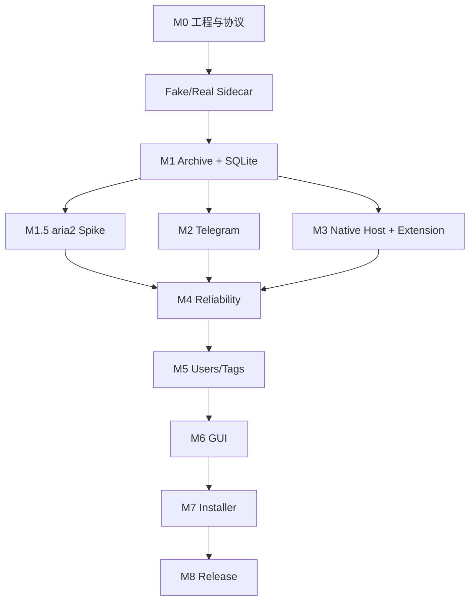

# 开发路线图

## M0：Rust ↔ Python 单 Tweet 下载

建立 Sidecar 握手、JSONL 命令和事件、Fake Worker、gallery-dl Adapter、staging 下载和崩溃检测。

## M1：SQLite 与本地归档

加入 migrations、Archive Manager、Job 状态机、Metadata Merger、FileStore、JSON/TXT、Tweet ID 幂等、恢复和 SHA-256。

当前进度：已完成 Job 状态机核心规则和第一版 SQLite migration；Repository、FileStore、真实数据库连接仍待实现。

## M1.5：aria2 技术验证

实现 `DownloadTransport` 抽象和 Rust aria2 Supervisor。验证 RPC、进度、取消、断点恢复、URL 过期、认证 Header、崩溃恢复和许可证分发要求。通过门槛后才加入 Automatic Router。

## M2：Telegram

实现 SecretStore、Official API Transport、Formatter、TagEngine、media reply/group、长文本 continuation、幂等补传。

## M3：MV3 Extension 与 Native Messaging

实现 XDomAdapter、MutationObserver、按钮、Service Worker、Native Host、Named Pipe、批量状态同步和重连。

## M4：可靠性

重试退避、错误分类、Cancel、Sidecar/aria2 恢复、文件完整性扫描、URL 刷新和事件历史。

## M5：用户与标签

稳定用户目录、名称历史、profile 文件、Quote/Reply 建模和用户自定义 TagEngine 规则。

## M6：Tauri GUI

Dashboard、Archive、Users、Settings 和操作菜单。

## M7：安装与生命周期

Sidecar 打包、Tauri externalBin、Native Host manifest/Registry、Single Instance、Tray、Autostart、Windows 安装器。

## M8：发布

签名更新、日志脱敏、备份恢复、诊断包、第三方许可证、版本回滚和发布 CI。

## 依赖顺序

